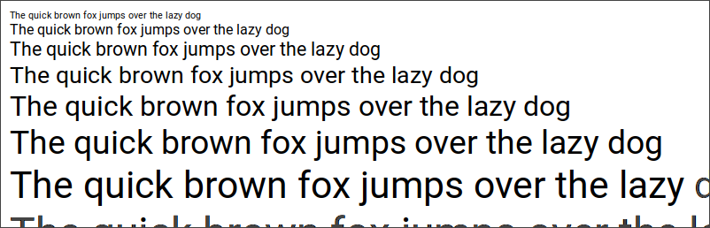
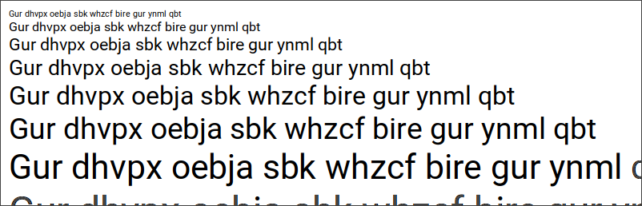
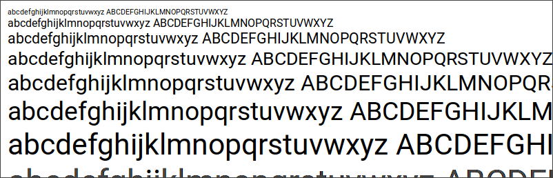
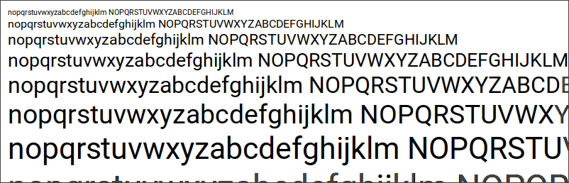

# font13

A [ROT13](https://en.wikipedia.org/wiki/ROT13) converter script for fonts.

## Usage

You will need [fontforge](https://fontforge.org/) to run [font13.py](font13.py):

```
$ fontforge -script font13.py font.ttf
```

Example:

```
$ sudo apt install fontforge

$ fontforge --version
...
Version: 20190801
...

$ wget --content-disposition https://fonts.google.com/download?family=Roboto

$ unzip Roboto.zip Roboto-Regular.ttf

$ ls -1 Roboto-Regular.ttf
Roboto-Regular.ttf

$ fontforge -script font13.py Roboto-Regular.ttf

$ ls -1 Roboto-Regular.ttf Ebobgb-Erthyne.ttf
Roboto-Regular.ttf
Ebobgb-Erthyne.ttf

$ cp Roboto-Regular.ttf Ebobgb-Erthyne.ttf ~/.fonts
```

## Screenshots

```
$ pango-view --waterfall --text 'The quick brown fox jumps over the lazy dog' --font Roboto

$ pango-view --waterfall --text 'The quick brown fox jumps over the lazy dog' --font Ebobgb
```





```
$ pango-view --waterfall --text 'abcdefghijklmnopqrstuvwxyz ABCDEFGHIJKLMNOPQRSTUVWXYZ' --font Roboto

$ pango-view --waterfall --text 'abcdefghijklmnopqrstuvwxyz ABCDEFGHIJKLMNOPQRSTUVWXYZ' --font Ebobgb
```




